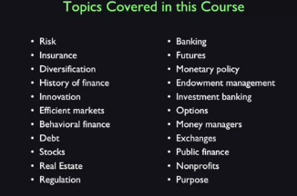

# Topics in Finance

## A List of Topics in Finance

Topics are:

- Risk
- Insurance
- Diversification
- History of Finance
- Innovation
- Behavioral Finance
- Debt
- Stocks
- Real Estate
- Regulation
- Banking
- Futures
- Monetary Policy
- Endowment Management
- Investment Banking
- Options
- Money Managers
- Exchanges
- Public Finance
- Nonprofit Finance
- Purpose of Finance

## W1L2

### Var Variance/Value at Risk

Value at risk is a measure used by some finance people to quantify risk of of an investment or of a portfolio and it's quoted in units of dollars for a given probability and time horizon. For example, if it says lets's say 1%, one-year value at risk of 10 million, it means that there is a 1% chance that the portfolio will lose 10 million in one year.

### Stress Testing

The stress test is a test usually ordered by government to see how some firm will stand up to a financial crisis.

### S&P 500

### Beta

Beta gives a measure of how much a stock moves in relation to the market. A $\beta$ of 2 means that the stock moves twice as much as the market. A $\beta$ of 0.5 means that the stock moves half as much as the market.

### market risk versus idiosyncratic risk

Market risk is the risk that affects all stocks in the market. Idiosyncratic risk is the risk that affects only one stock.

### Normal Distribution and Outliers

### Cauchy Distribution

This is a fait tailed distribution where the probability of a random variable taking value away from the mean is not negligible even when the value is very far away from the mean (unlike the normal distribution).

### Central Limit Theorem

The central limit theorem says that the sum of a large number of independent random variables will be approximately normally distributed. (This does not work if the underlining distribution is fait tailed.)

### Covariance

Covarinace between two stocks measures how independent the two stocks are. If the covariance is zero, the two stocks are independent. If the covariance is positive, the two stocks tend to move in the same direction. If the covariance is negative, the two stocks tend to move in opposite directions. Mathematically, covariance is defined as:
$$
\operatorname{cov}(X, Y)=\operatorname{E}\left[(X-\mu_{X})(Y-\mu_{Y})\right]
$$
where $\mu_X$ and $\mu_Y$ are the means of $X$ and $Y$ respectively.
>Lower covariance is safer.

## W1L3

### Isurance

### Risk Pooling

Assuming independence, the distribution of clain follows binomial distribution. If there are $n$ policies and each have probability $p$ of claim, the standard deviation of the total claim is
$$
\sigma=\sqrt{p(1-p)/n}
$$
This means that if $n$ is large, the standard deviation is small. This is the *Law of Large Numbers*. This is the idea of risk pooling.

### Moral Hazard and Selection Bias

Moral hazard is the tendency of people to take more risk when they are insured. Selection bias is the tendency of people to buy insurance when they are more likely to have a claim.
