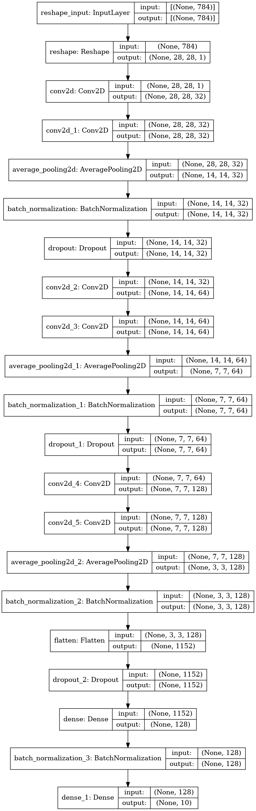

- [1. The Data Source](#1-the-data-source)
- [2. Aim of the Project](#2-aim-of-the-project)
- [3. Preparation of Dataset](#3-preparation-of-dataset)
  - [3.1. Further Preparation of Dataset for Working with Neural Networks](#31-further-preparation-of-dataset-for-working-with-neural-networks)
- [4. The Performance Metrics](#4-the-performance-metrics)
- [5. Base Model](#5-base-model)
  - [5.1. Machine Learning Model](#51-machine-learning-model)
  - [5.2. Deep Learning Model](#52-deep-learning-model)
- [6. The Training Process](#6-the-training-process)
  - [6.1. Machine Learning Models](#61-machine-learning-models)
  - [6.2. Deep Learning Models](#62-deep-learning-models)
    - [6.2.1. Preprocessing and Callbacks](#621-preprocessing-and-callbacks)
    - [6.2.2. Architecture Used](#622-architecture-used)
    - [6.2.3. Reducing Overfitting](#623-reducing-overfitting)
- [7. Fine Tuning Process](#7-fine-tuning-process)
  - [7.1. Machine Learning Models](#71-machine-learning-models)
  - [7.2. Deep Learning Models](#72-deep-learning-models)
- [8. Model Deployment, if any](#8-model-deployment-if-any)
- [9. Result](#9-result)
  - [9.1. Machine Learning Models](#91-machine-learning-models)
  - [9.2. Deep Learning Models](#92-deep-learning-models)
- [10. Question Section](#10-question-section)
  - [10.1. What improvements can be made?](#101-what-improvements-can-be-made)
  - [10.2. If you were to do something differently, what would that be?](#102-if-you-were-to-do-something-differently-what-would-that-be)
  - [10.3. What were some mistakes you made?](#103-what-were-some-mistakes-you-made)
  - [10.4. What were the most challenging aspect of the project and how you overtook it?](#104-what-were-the-most-challenging-aspect-of-the-project-and-how-you-overtook-it)
  - [10.5. Why did DL models work while ML models didn't work that well?](#105-why-did-dl-models-work-while-ml-models-didnt-work-that-well)
  - [10.6. Balanced or unbalanced classes?](#106-balanced-or-unbalanced-classes)
# 1. The Data Source
The data is the famous MNIST digit recognition dataset. I've used the dataset from kaggle which consists of 42,000 training images and 28,000 test images. Each image is a 28x28 grayscale image, associated with a label from 0 to 9. The data, I've used is in CSV format with 28*28+1=785 columns, one for each pixel, and one for the label. The pixel values are not normalized, and are in the range 0-255. The data is available at [Kaggle](https://www.kaggle.com/c/digit-recognizer/data).

# 2. Aim of the Project
The goal of the project is to develope a model that can classify the images into their respective labels.

# 3. Preparation of Dataset
Not lot of preprocessing is neede for this dataset as it is already in a well formatted CSV file. The only thing that needs to be done is to normalize the dataset so that the pixel values range from 0-1 instead of 0-255. This is done by dividing the pixel values by 255. The dataset is then split into training and validation sets. The training set is used to train the model and the validation set is used to evaluate the model. The validation set is 10% of the training set.

## 3.1. Further Preparation of Dataset for Working with Neural Networks
I'm using Tensorflow for deep learning models. With GPU if we do some preprocessing to the dataset using the `tf.Data` API, the training time can be reduced significantly. Though, we have a very small dataset and we can go on without using these steps, I've done it anyway. In brief, these are the steps which are done to make the training faster:
1. Create Tensorflow Dataset from numpy array using `tf.data.Dataset.from_tensor_slices` and `tf.data.Dataset.zip`.
2. Batched the datasets with batch size of 64.
3. Used `prefetch` which prepares subsequent batches of data whilst other batches of data are being computed on.
4. Used `tf.data.AUTOTUNE` so that Tensorflow can figure out itself how many number of parallel calls it should make.

See the article [Better performance with the tf.data API](https://www.tensorflow.org/guide/data_performance)

# 4. The Performance Metrics
The dataset is balanced, meaning that there are the same number of samples for each class. So, I've used accuracy as the performance metric. Kaggle also uses the same metric to evaluate the model. This is another reason why I've used accuracy as the performance metric.

# 5. Base Model
## 5.1. Machine Learning Model
The base model is a simple logistic regression for machine learning model. The base model give an accuracy of 91.31% on the validation set.

## 5.2. Deep Learning Model
Here, the base model used is a two layered model with hidden layer with 128 nuerons and `relu` activation function. The output layer is a softmax with 10 nuerons, one for each class. This architecture has a total  101,770 parameters. The model is trained for 10 epoch resulting in a test accuracy of 97.11%. This is a greate improvement over the accuracy of the base ML model.

# 6. The Training Process
## 6.1. Machine Learning Models
Various ML models are tried, first using default values of the hyperparameters and then are fine-tuned if the result is coming out to be satisfactory.

## 6.2. Deep Learning Models

### 6.2.1. Preprocessing and Callbacks
To make the training faster, `tf.data` API is used as descibed in section 3.1. Apart from these, some more steps are also done.

Before starting experimenting, two callbacks has been defined to keep track of the experiments. These are:
1. `ModelCheckpoint`: This will save the weights of the best model which can be loaded later.
2. `EarlyStopping`: This callback will stop the training if the performance is not improving.
   
`Adam` optimizer is used throughout the training process. Loss is set to be `categorical_crossentropy`.

### 6.2.2. Architecture Used
The base model uses a plain feed forward network. However, CNN are known to work the best with images so I shifted from fully connected layers CNN's. A variety of architectures using CNN are considered.

### 6.2.3. Reducing Overfitting
To avoid overfitting, mainly two things are done:
1. Using the `Dropout` layer which drops which randomly sets input units to 0 with a frequency of rate at each step during training time.
2. The `BatchNormalization` layer which applies a transformation that maintains the mean output close to 0 and the output standard deviation close to 1. This is shown to be have a regulating behaviour and also makes the model fit well.

Apart from these, some times, `l1` and `l2` normalization is also performed on the weights of CNN by setting `kernel_regularizer` parameter of CNN to `tf.keras.regularizers.[l1]/[l2]/[l1l2]` or 

# 7. Fine Tuning Process
## 7.1. Machine Learning Models
Usually, I perform a three step grid search for the hunt of the best parameters. In first try, grida very coarse grid is set which becomes finer and finer as the iteration reaches to the third. Sometime, even a fourth grid search is also performed. The fine tuning for ML model is done this way for this project.

## 7.2. Deep Learning Models
Since I was looking for CNN architectures, I started with some architectures which were already known to perform great, like VGG16 and used them to built a similar architecture. Also, `KerasTuner` was used to do some of the fine tuning.

# 8. Model Deployment, if any
The model is not deployed.

# 9. Result
## 9.1. Machine Learning Models
The best performing model is the SVM with an accuracy of **97.60%** on the validation set. The xgboost also performs similarly with an accuracy of **97.50%** on the validation set. Even these results looks greate but are nothing compared to the deep learning models.

## 9.2. Deep Learning Models
The best performing model has an accuracy of **99.57%** on test set. On kaggle, this gives an accuracy of 99.48%. This is deep CNN with about **20 layers** and **436,010** trainable parameters. Below is the architecture:

# 10. Question Section
## 10.1. What improvements can be made?
We can try exploring some more architectures in hope that the result will be better. Also, I've not used transfer learning. We can try using some pre-trained models and fine tune them to get better results. Also, we have seen that the model performs poor some images which are very alike. There are also some images which is not possible to read even for human and hence its label in ambiguous. We can try labeling these images correctly and then train the model again. Apart from these, the model is trained on just 42k images. We can try training the model on more images.

## 10.2. If you were to do something differently, what would that be?
Transfer learning can be used to get better results. I might also try some more architectures. 

## 10.3. What were some mistakes you made?
I was training a number of CNN architectures and the result were not coming out to be good. In fact, the results were worse then that to the base DL model. It turned out that I was using `GlobalAveragePooling2D`  at the last of the CNN's to feed the extracted fearures to fully connected layers and it was not capturing the features correctly. It took me some time to realise that I should try the `GlobalMaxPooling2D` instead. I did and there was a huge boost it accuracy! 

Another mistake was using `l1` and `l2` normaliztion as regulation technique. Using them was resulting in underfitting even if the value of the normalization were set to be `0.01`. It turned out that the `Dropout` and `BatchNormalization` layers were better options for regularization.

## 10.4. What were the most challenging aspect of the project and how you overtook it?
The most challenging aspect of the project was to avoid overfitting of the dataset. Even a simple 3-4 layered nueral network was overfitting the dataset severly. To reduce overfitting, I first tried using `l1` and `l2` normalization. But, it was not working. Using a small value of `l1` and/or `l2` was reducing the performance very much and the model was not fitting even the train set. The final working solution for me turned out to be using `Dropout` and `BatchNormalization` layers. Using these, I was able to train deep CNN's without much overfitting the dataset.

## 10.5. Why did DL models work while ML models didn't work that well?
Machine learning models performs great when we have structured data. But, when we have images, the data is not structured. The pixels are not independent of each other. The pixels in the image are correlated. This is why ML models did not work that well.

DL models, that is, CNN's, work great because they are extract information from the images like edges, corners, etc. and then use these features to classify the images. This is the same way our brain works. What more, use of CNN vastly reduces the number of parameters in the model and hence the chances of overfitting also reduces.

## 10.6. Balanced or unbalanced classes?
There are 10 classes in the dataset and all are balanced. However, there might be some sort of unbalance in train and test dataset because of the random shuffling. But, this is not a big issue.

