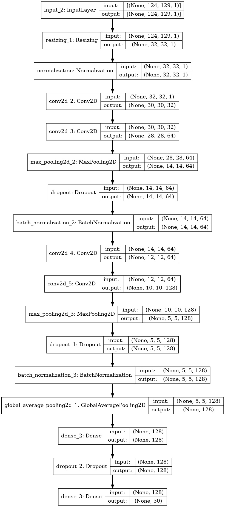

- [1. The Data Source](#1-the-data-source)
- [2. Aim of the Project](#2-aim-of-the-project)
- [3. Preparation of Dataset](#3-preparation-of-dataset)
  - [3.1. Getting Data in Right Format](#31-getting-data-in-right-format)
    - [3.1.1. Raw Binary Audio Files to Waveform](#311-raw-binary-audio-files-to-waveform)
    - [3.1.2. Waveform to Spectrogram](#312-waveform-to-spectrogram)
    - [3.1.3. Label and Label ID](#313-label-and-label-id)
  - [3.2. Making Training Faster](#32-making-training-faster)
- [4. The Performance Metrics](#4-the-performance-metrics)
- [5. Base Model](#5-base-model)
- [6. The Training Process](#6-the-training-process)
- [7. Fine Tuning Process](#7-fine-tuning-process)
- [8. Model Deployment, if any](#8-model-deployment-if-any)
- [9. Result](#9-result)
- [10. Question Section](#10-question-section)
  - [10.1. If you were to do something differently, what would that be?](#101-if-you-were-to-do-something-differently-what-would-that-be)
  - [10.2. What improvements can be made?](#102-what-improvements-can-be-made)
  - [10.3. What were the most challenging aspect of the project and how you overtook it?](#103-what-were-the-most-challenging-aspect-of-the-project-and-how-you-overtook-it)
  - [10.4. Some mistakes you made and how you corrected them?](#104-some-mistakes-you-made-and-how-you-corrected-them)
# 1. The Data Source
The data was released by TensorFlow of 65,000 one-second long utterances of 30 short words, by thousands of different people. The dataset used in the project was taken from Kaggle. Twenty core command words were recorded, with most speakers saying each
of them five times. The core words are "Yes", "No", "Up", "Down", "Left",
"Right", "On", "Off", "Stop", "Go", "Zero", "One", "Two", "Three", "Four",
"Five", "Six", "Seven", "Eight", and "Nine". To help distinguish unrecognized
words, there are also ten auxiliary words, which most speakers only said once.
These include "Bed", "Bird", "Cat", "Dog", "Happy", "House", "Marvin", "Sheila",
"Tree", and "Wow".

# 2. Aim of the Project
The goal of the project is to create a model that understands simple spoken commands. The model will be tested to recognize all the 30 words.

# 3. Preparation of Dataset
The dataset is made up of audio data. Obviuosly, we can not use these raw data to train a model. Quite a few steps are involved in the preparation of the dataset.

## 3.1. Getting Data in Right Format
### 3.1.1. Raw Binary Audio Files to Waveform
`tensorflow.audio.decode_wav` is used to read the raw binary audio file and creating a waveform of that.

### 3.1.2. Waveform to Spectrogram
Using just the raw waveform is not a good way to train model. Instead, we have to take one step further and create spectrogram for the individual audio files. `tensorflow.signal.stft` is used to create the spectrogram. The steps used for this are:
1. The waveforms need to be of the same length, so that when you convert them to spectrograms, the results have similar dimensions. This can be realized using zero-padding the audio clips that are shorter than one second (Audios are about one minute long on averge).
2. We'll be using `tf.signal.stft` for the conversion. The function accepts two parameters `frame_length` and `frame_step`. We have to chose these parameters in such a way that generated spectrogram is almost square.
3. The `tf.signal.stft` return an array of complex numbers. We'll be intersted in just the magnitude of it.

### 3.1.3. Label and Label ID
The label of the audio is extracted using the filename of that audio. Then, one hot encoding is done to convert the label to label ID.

## 3.2. Making Training Faster
I'm using Tensorflow for deep learning models. With GPU if we do some preprocessing to the dataset using the `tf.Data` API, the training time can be reduced significantly. Though, we have a very small dataset and we can go on without using these steps, I've done it anyway. In brief, these are the steps which are done to make the training faster:
1. Create Tensorflow Dataset from numpy array using `tf.data.Dataset.from_tensor_slices` and `tf.data.Dataset.map`.
2. Creating custom functions for train and test data to be used in the above step.
3. Batched the datasets with batch size of 64.
4. Used `prefetch` which prepares subsequent batches of data whilst other batches of data are being computed on.
5. Used `tf.data.AUTOTUNE` so that Tensorflow can figure out itself how many number of parallel calls it should make.

See the article [Better performance with the tf.data API](https://www.tensorflow.org/guide/data_performance)
# 4. The Performance Metrics
Accuracy is used as performance metric. 

# 5. Base Model
The base model is a simple CNN with two CNN layers having 32 and 64 filter followed by fully connected layers. The model is trained for 10 epochs and the accuracy is 0.79.

# 6. The Training Process
Base model is trained for 10 epochs and is performing quite well, meaning that we have to try fitting more complex models with the same architectures. This is what I've done. Deeper and deeper CNN's are fitted with `MaxPooling2D` layers, `GlobalAveragePooling2D` layer and finally a fully connected layer. Also, `Dropout` and `BatchNormalization` layers are added to prevent overfitting. The model is trained for 10 epochs and the accuracy is 0.90.

# 7. Fine Tuning Process
Fine tuning of model is done in terms of increasing the depth of the architecture. CNN's with more and more layers are fitted. To avoid overfitting, layers like `Dropout` and `BatchNormalization` are added. Also, the input shape for the model is reduced to just `(32,32)`. This reduces the chances of overfitting significantly.
# 8. Model Deployment, if any
The model is not deployed. However, the model is saved as a `h5` file and can be used for prediction.

# 9. Result
The best model has the following architecture:

The model gives a validation accuracy of 0.942. This accuracy is reached after training the model for 100 epochs.

# 10. Question Section

## 10.1. If you were to do something differently, what would that be?
I might use data augmentation to increase the size of the dataset. There are background noises available seperate from the original dataset. Adding them to the noise free dataset will make the dataset more realistic. This is also a thing which I would like to try.

## 10.2. What improvements can be made?
The model is trained on data which has very little to no background noise. In real world, this won't be the case and hence we can create a more realistic dataset and train our model on it. Data augmentation can be performed to increase the size of the dataset. Also, we can try to use transfer learning to improve the performance of the model.

## 10.3. What were the most challenging aspect of the project and how you overtook it?
The most challenging task was to get the raw audio file in a right format to train for the model. The idea was to convert the raw binary audio file to an `image` which can then be used to train CNN's. This was achieved by converting the raw audio file to waveform and then to a spectrogram using `tensorflow.signal.stft` function. However, we want the spectrograms to be almost of the same shape, for this, the original waveforms wrere zero-padded to make them of the same length. Also, the `frame_length` and `frame_step` parameters were chosen in such a way that the generated spectrograms are almost square. Tensorflow tutorial was reaaly helpful in this regard.

## 10.4. Some mistakes you made and how you corrected them?
